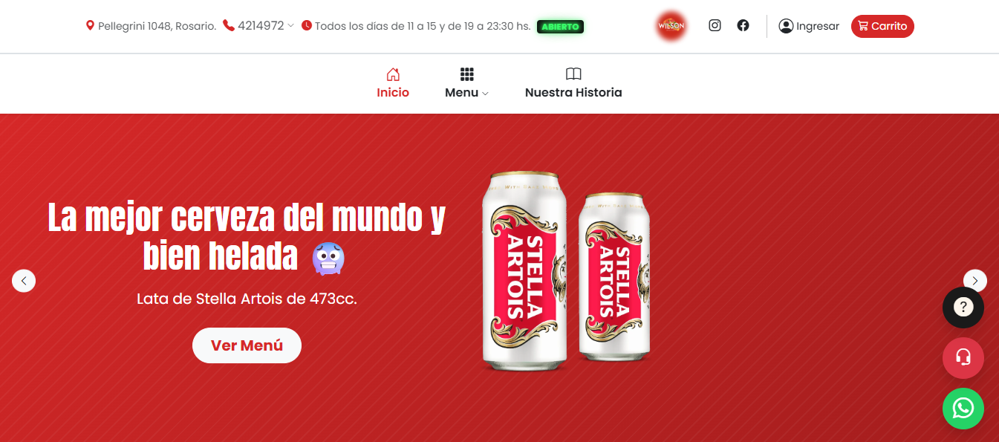
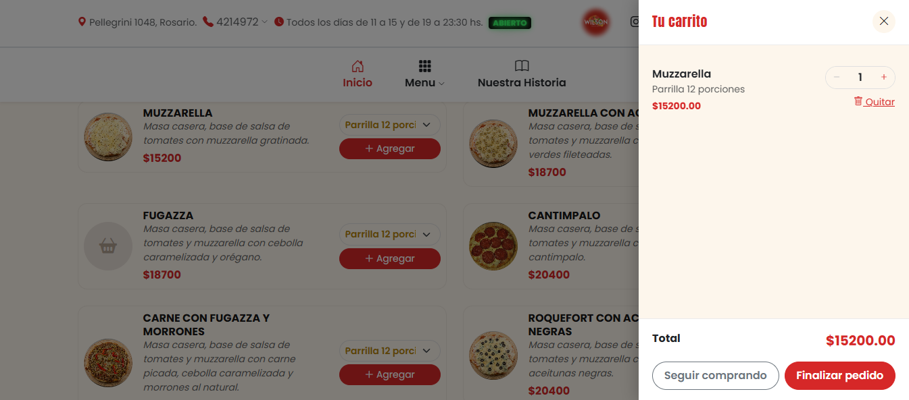
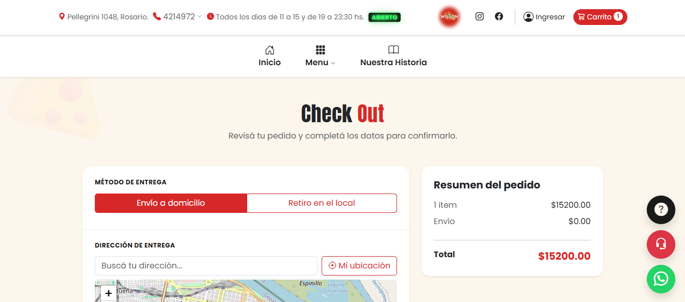
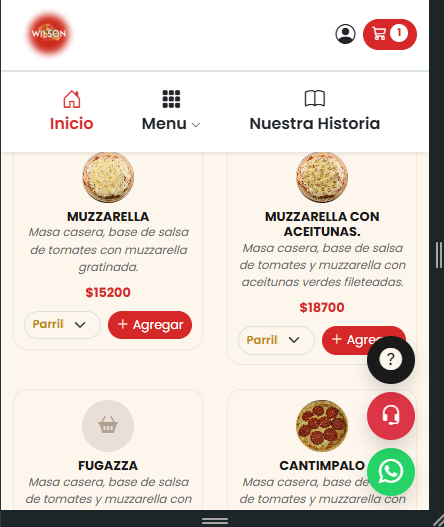
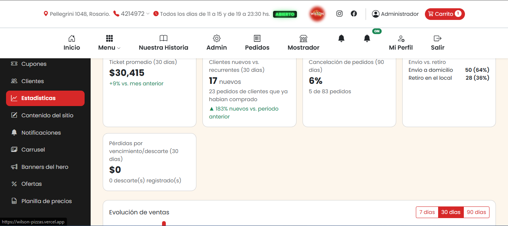
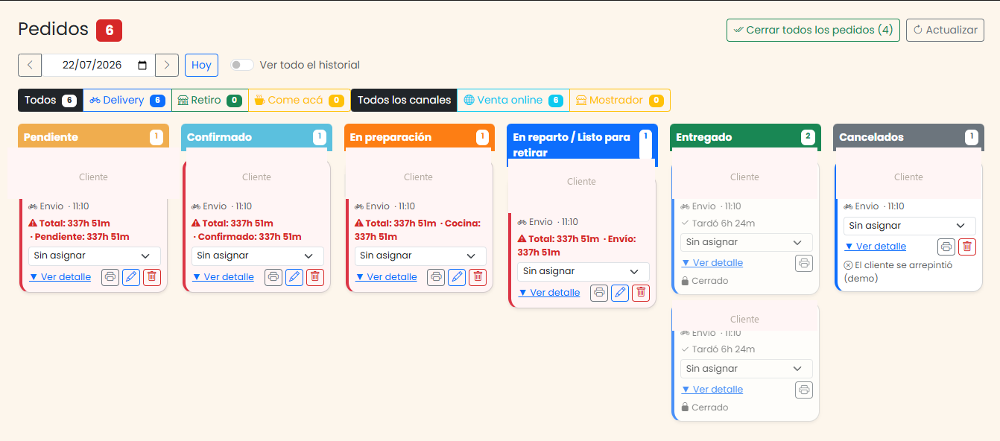
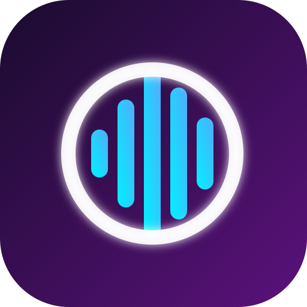

📍 Rosario, Santa Fe, Argentina · 💼 Disponible para trabajos freelance

Estudiante de la **Tecnicatura Superior en Desarrollo de Software** en el [Terciario Urquiza](https://terciariourquiza.edu.ar/), Rosario. Aprendo construyendo proyectos reales de punta a punta: desde la base de datos hasta la interfaz, pasando por el deploy en producción.

*Full Stack Developer student (Angular · Node.js · MySQL), based in Rosario, Argentina. I learn by shipping real, production-deployed projects — not just tutorials.*

---

## 🍕 Proyecto destacado: Wilson Pizzas

Sistema de pedidos online completo para una pizzería real, construido y desplegado en producción de punta a punta: catálogo interactivo, carrito, checkout, pagos, gestión de pedidos en tiempo real, control de stock, analíticas y un panel de administración completo.

**[🔗 Ver demo en vivo](https://wilson-pizzas.vercel.app)**

**Stack:** Angular 22 (standalone components + signals) · Node.js/Express · MySQL · Socket.IO · JWT · Cloudinary · Leaflet + geocoding · Web Push (VAPID) · ExcelJS

**Algunas features del backend y frontend:**
- API REST en capas (`routes → controllers → models`) con 17 controllers, 19 modelos y ~50 endpoints
- Autenticación JWT con roles (admin / cliente / invitado) y rate limiting contra fuerza bruta
- Pedidos y notificaciones en tiempo real con Socket.IO + Web Push
- Panel admin con Kanban de pedidos (drag & drop), gestión de stock con predicción de duración e ingredientes por receta, y analíticas de negocio (embudo de conversión, AOV, heatmaps de ventas)
- Subida de imágenes dual-mode: Cloudinary en producción, filesystem en desarrollo
- Zonas de envío geolocalizadas dibujadas sobre un mapa (Leaflet + LocationIQ), validadas server-side
- Sistema de auto-migraciones de base de datos (23 migraciones incrementales) para actualizar el esquema sin downtime
- Frontend Angular con signals para estado reactivo, lazy loading por ruta y arquitectura standalone sin NgModules

Panel admin: analíticas de negocio + Kanban de pedidos en tiempo real

> El repositorio del código es privado (es la base de un negocio real), pero el demo está en vivo y puedo compartir el código en una entrevista.

<b>🇬🇧 English summary</b>

 

Full online ordering system for a real pizzeria, built and deployed end-to-end: interactive catalog, cart, checkout, real-time order management, inventory control, analytics and a full admin panel.

**Stack:** Angular 22 (standalone + signals) · Node.js/Express · MySQL · Socket.IO · JWT · Cloudinary · Leaflet · Web Push.

Live demo: https://wilson-pizzas.vercel.app — source is private (it runs a real business) but available on request for interviews.

---

## 🎸 STRUM & OCTAVE

Fork independiente activo de dos proyectos de [opria123](https://github.com/opria123): una IA que convierte canciones en charts jugables para Clone Hero/GHWTDE, y el editor visual de escritorio que los edita. Sigo iterando sobre la base original con crédito completo a opria123 — sin depender de su ritmo de releases.

<table align="center">
<tr>
<td width="50%" valign="top">

**[STRUM](https://github.com/Willyssj3/strum)** — *Spectral Transcription & Rhythm Understanding Model*

Pipeline de audio-a-chart con transcripción neuronal de batería, mapeo de trastes de guitarra/bajo, transcripción vocal (Whisper) y detección de teclado.

</td>
<td width="50%" valign="top">

**[OCTAVE](https://github.com/Willyssj3/octave)**  — *Orchestrated Chart & Track Authoring Visual Editor*

Editor de escritorio para crear y ajustar charts a mano, integrado con STRUM. Electron + React + Three.js.

</td>
</tr>
</table>

Trabajando codo a codo con el upstream: [PR con LaneAcc en la tabla de performance](https://github.com/opria123/strum/pull/5) e [issue de doc/code drift](https://github.com/opria123/strum/issues) reportados sobre opria123/strum.

---

## 🛠️ Stack & herramientas

**Además:** JWT, REST APIs, arquitectura en capas, integración con servicios externos (Cloudinary, LocationIQ, Web Push), Excel (ExcelJS), Postman, VS Code.

---

## 🎓 Formación

- **Tecnicatura Superior en Desarrollo de Software** — [Terciario Urquiza](https://terciariourquiza.edu.ar/), Rosario *(último año, segundo cuatrimestre — graduación estimada fines de 2026 / principios de 2027)*

---

## 🎮 Fuera del código

Cuando no estoy programando, lo más probable es que esté corriendo o jugando **League of Legends** — main **Heimerdinger** 🔧🤖 *(sí, hasta en el Rift me gusta construir cosas)*.

---

## 📊 GitHub stats

<!--
El instance público de github-readme-stats.vercel.app está caído desde enero 2026
(503 DEPLOYMENT_PAUSED, ver https://github.com/anuraghazra/github-readme-stats/issues/4737).
Las tarjetas de "Estadísticas de GitHub" y "Lenguajes más usados" se sacaron temporalmente
para no mostrar imagen rota. Se pueden restaurar apenas se self-hostee una instancia propia
en Vercel (botón de deploy en el repo de anuraghazra/github-readme-stats), reemplazando el
dominio en estas URLs:

-->

## 📈 Actividad

<picture>
  <source media="(prefers-color-scheme: dark)" srcset="https://raw.githubusercontent.com/Willyssj3/Willyssj3/output/github-contribution-grid-snake-dark.svg" />
  <source media="(prefers-color-scheme: light)" srcset="https://raw.githubusercontent.com/Willyssj3/Willyssj3/output/github-contribution-grid-snake.svg" />
  
</picture>

---

📫 **¿Hablamos?** [LinkedIn](https://www.linkedin.com/in/brian-williams-moro-570532193/) · brianmorossj3@gmail.com

